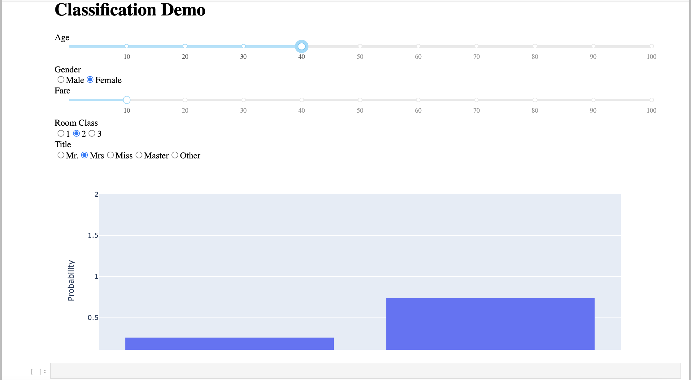

# titanic-RFC

## Description
The [titanic](https://en.wikipedia.org/wiki/Titanic) was one of the greatest engineering marvels of its time. 
Few could have forseen the disastrous end the ship would meet including the deaths of more than 1500 individuals.
However, were these deaths arbitrary, or was their a pattern to the madness that ensued. 
It is well known that "save the women and children" was a major objective that increased survival rates of those groups.
However, to what extent does such a pattern appear in the data, and what other trends can we discover?

## Program Design
In this repository, the titanic classification notebook includes some exploratory data analysis
as well as a [random forest classifier](https://scikit-learn.org/stable/modules/generated/sklearn.ensemble.RandomForestClassifier.html) to predict the survival of a passenger given information about them.
This model is then saved using [joblib](https://joblib.readthedocs.io/en/latest/) for use later on. 
The interactive_demo notebook uses this model in conjuction with a [Dash](https://plotly.com/dash/) app. 
This Dash app allows for a user to manipulate the charateristics of a traveler (the inputs for the classifier) and see the prediction of suvival.

## Requirements
* [Numpy 1.2+](https://numpy.org/)
* [Pandas 1.2+](https://pandas.pydata.org/)
* [Seaborn 0.1+](https://seaborn.pydata.org/)
* [Joblib 0.16+](https://joblib.readthedocs.io/en/latest/)
* [Dash 1.18+](https://plotly.com/dash/)
* [Jupyter_Dash 0.4+](https://pypi.org/project/jupyter-dash/#history)

## Final Output Example

